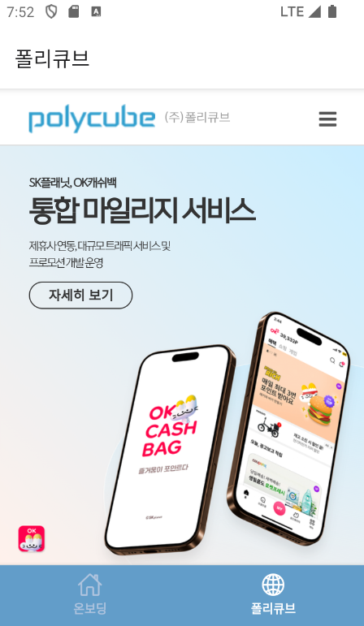

## 온보딩 페이지

 

1. 반응형으로 제작된 온보딩 페이지입니다.
2. 온보딩 페이지에서는 회사의 소개 내용을 스크롤을 통해 확인할 수 있습니다. 페이지 하단에 웹사이트 방문을 유도하는 버튼이 제공됩니다. 

## 웹뷰 페이지

 

1. 폴리큐브 페이지에서는 회사 웹사이트가 웹뷰를 통해 표시됩니다.
2. 앱 내부에서 화면 확대/축소,스크롤이 가능합니다.
